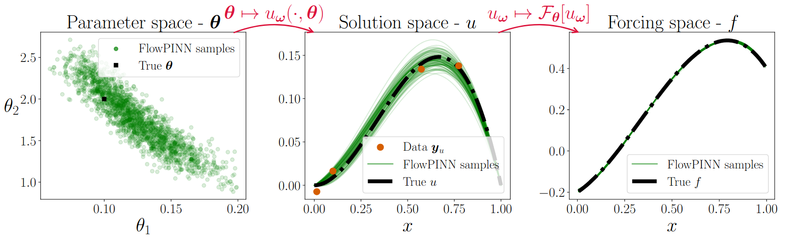

# FlowPINNs: A Variational Framework for PDE Parameter Inference and Uncertainty Quantification (AISTATS 2026)

JAX implementation of flowPINNs accompanying our [AISTATS 2026 paper](https://openreview.net/forum?id=SqaYpW6poC). FlowPINNs are designed for parameter inference and uncertainty quantification in partial differential equations (PDEs).

---

## Example Results

FlowPINN applied to an inverse problem involving a 1D reaction-diffusion PDE:



A normalising flow defines an an approximation to the posterior over the PDE parameters $\boldsymbol{\theta}$ (left panel). Each parameter sample gets mapped to an estimate of the PDE solution $u$ using a parameterised PINN (centre panel). Applying the differential operator to each parameter/function sample pair defines an associated forcing term (right panel).

---

## Repository Structure

- [``flowpinns/``](flowpinns/) – Core library  
- [``experiments/``](experiments/) – Notebooks for reproducing paper experiments  
- [``images/``](images/) – Figure used in the README  

---

## Installation

Clone the repository: 

```
git clone https://github.com/dodaltuin/flowpinns.git
cd flowpinns
```

Install dependencies using conda:

```
conda create -n flowpinns-env python=3.10
```

```
conda activate flowpinns-env
```

```
pip install "jax[cuda12]" -f https://storage.googleapis.com/jax-releases/jax_cuda_releases.html
```

```
pip install flax optax jupyterlab matplotlib
```
---


## Citation

Please cite our paper if you use this code:

```
@inproceedings{
dalton2026flowpinns,
title={Flow{PINN}s: A Variational Framework for {PDE} Parameter Inference and Uncertainty Quantification},
author={David Dalton and Hao Gao and Dirk Husmeier},
booktitle={The 29th International Conference on Artificial Intelligence and Statistics},
year={2026},
url={https://openreview.net/forum?id=SqaYpW6poC}
}
```

